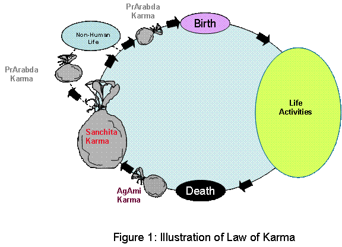

We concluded Unit -1 with Krishna&#39;s response to Arjuna that kAma (desire) and krOdha(anger) are the root causes of ignorance and hence man&#39;s inability to experience the divinity with in him. We will review the mechanics of this in this unit.

From our birth to death man (or woman), is engaged in various activities. 
All the activities have the effect of producing the fruits of action. 

anishTam ishTam mishram cha tri-vidham karmaNah phalam 
bhavati atyAginAm prEtya na tu sanyAsinAm kvachit

The three-fold fruits of action , desirable (life of dEvatAs), undesirable ( life of animals ) and mixed (human lives) accrue to 
the non-renouncer (of fruits of actions),after death; but never to the renouncer (gIta 18-12).

The individual has to experience these fruits of action (karmaphala) in the vehicle of dEvas, humans or animals. So this makes it necessary to be born 
again to experience the fruits of action, be it desirable or non-desirable. This is the law of karma. Figure 1 illustrates this law of karma.

   
The law of karma and reincarnation to experience the karmaphala are the corner stones of the philosophies of sanAtana dharma. We need to understand the three categories of karma (phala) in order to fully understand the law of karma.

1.    sanchita karma (karma in storage) 
2.    prArabdha karma (karma that has begun to bear fruit) 
3.    AgAmi karma (karma resulting from future activities).

A man&#39;s current life comes his way to experience a fraction of the fruits of his activities in past lives, stored as sanchita karma. The fraction is called prArabdha karma or karma that has begun to bear fruit. The experiences of this life are the fruits of that fraction of past activities. As he go through this life, he does some good acts and some not so good acts and so on. These acts, if they are desire oriented will result in additional fruits to be experienced in future lives. 

The karma, associated with the activities of this life is the AgAmi karma, that gets added into and stored in the sanchita karma, after death. Desire is the motive for a man&#39;s activities, which is captured very succinctly in the following two verses of gIta;

dhyAyatO vishayAn pumsah sanghah tEshu upajAyatE 
sanghAt sanjAyatE kAmah kAmAt krOdhah abhijAyatE

krOdhAt bhavati sam-mOhah sam-mOhat smriti vibramah 
smriti brimshAt buddhi nAshah buddhi nAshAt praNashayti

As man dwells on sense objects, he develops an attachment to them; the attachment turns in to desire to possess them (a fulfilled desire will lead to indulge in it or creates higher desires); an unfulfilled desire creates anger in him;anger leads to delusion which in turn causes loss of memory; loss of memory results in destruction of discrimination; Once he looses discrimination, he perishes. (Gita 2-62 and 63)

(there is an anti-dote to this, which we will review a little later). -These two verses capture the basic message of the law of karma; Being caught in the web of births and deaths is what Krishna describes as "he perishes".

It is generally the story of most humans that the pot of sanchita karma keeps growing with each life. As more karma is added to the pot, it necessitates additional births to experience the fruits of action. This is because of man&#39;s ignorance that happiness is derived by sense objects, which he goes after every waking moment of his life. The loss of discrimination is what leads man to wrongly identify happiness as coming from sense objects. D.V. Gundappa says in Kagga, that what man calls as happiness is a short interval between two long intervals of sorrow or happiness is absence of sorrow.

We said earlier that the prArabdha karma is only a small fraction of the sanchita karma. This fraction is generally understood to be proportional to the forbearing ability of the individual jIva to withstand misery and sorrow. If one&#39;s entire sanchita karma were to be translated to prArabdha  for one life, the man will collapse under the weight of the misery (suicide!), that he will not fulfill the obligations of the prArabdha, which necessitates another life anyway. So God in His infinite mercy, will spare the human from such extreme encounters. So the jIva moves from life to life to experience his own desires, adding to the store of karma with each appearance, necessitating more births and so on. 

What is the strategy for relief from the cycle of births and deaths? What is the exit strategy?  Theoretically speaking, the answer seems to be simple enough - (1) do not add more AgAmi karma to the karma in storage and /or neutralize the store of karma (sanchita) once and for all. [ Here, an analogy can be made to an imaginary ring highway around a metropolitan area; this highway has no marked exits. A vehicle, with a perpetual source of energy, keeps going round and round with out any definite purpose. Such a vehicle, if it needs to get out, has to make a determined plan for and execute an exit strategy].

The Rishis of sanAtana dharma have determined such an exit strategy for a man to escape from the cycle of the law of karma. This strategy is a four step preparatory process called "sAdhana chatushTaya" a four step spiritual discipline. The four steps are

1.    vivEka (discrimination of Real from unreal.) 
2.    vairAgya (detachment or dispassion from sense objects.) 
3.    shamAdi shat sampatti (a collective group of six behavior traits.) 
4.    mumukshtva (intense desire to achieve permanent bliss).

This preparatory process is the subject matter for Unit - 3.
