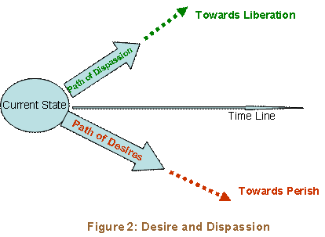
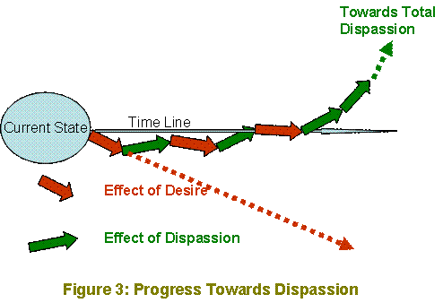

The Rishis of sanAtana dharma have devised an exit strategy for a man to escape from the cycle of the law of karma. This strategy is a four step preparatory process called "sAdhana chatushTaya" - a four step spiritual discipline, followed by shravaNa (study of scriptures), manana (living the scriptures) and nidhi-dhyAsana (deep meditation on Brahman).

The four step preparatory process is

<ol>
<li>vivEka (discrimination of Real from unreal). </li>
<li>vairAgya (detachment or dispassion from sense objects) </li>
<li>shamAdi shat sampatti ( a collective group of six behavior traits) </li>
<li>mumukshtva ( intense desire to achieve permanent bliss). </li>
</ol>

The sAdhana chatushTaya is described by BhagavAn Shankara in VivEka ChUDAmaNI as follows;

Adou nitya-anitya vastu vivEkah parigaNyatE 
iha-amutra phalabhOga virAgah tadanantaram 
shamAdi shatka sampittih mumukshatvam iti sphuTam 
  
- Verse 19.

&nbsp;The first discipline is the discrimination between the Real and unreal.  The next discipline is the detachment or dispassion from the enjoyments of 
the world here and after death (heaven). The third discipline is the practice of the six behavior traits - shama, dama, uparati, samAdhAna, shradda and titIksha; the fourth discipline is the intense desire for escape from this samsAra or realization of the divinity in her or him. 

The order in which they are stated is also very important as we discuss below.

The first step is to understand what is Real (nitya) and what is unreal (anitya). The mind generates several thoughts. The thoughts are debated internally in the mind. Intellect helps the individual to &nbsp;sort out the thoughts into right (of having value) or wrong (not of any value). Accepting the useful one and rejecting the useless is the discrimination faculty (vivEka).  Any entity that undergoes change in time and space is unreal or anitya. An entity that remains unaffected in time and space is permanent and is called Real or Nitya.  In the context of jIva, jagat and Iswara (Brahman - Brahman is the vEdAntic word for Iswara or God, not to be confused with the four headed creator brahmA), it is our experience that jIva and Jagat are affected by space and time; so they are anitya. The shruti declares that Iswara is unaffected by time and space (we have to accept the shruti here, since we do not have the ability to determine the nature of Iswara at this time) and hence is classified as Real. This understanding that Brahman is the only Real entity and everything else is unreal is viVeka. This is the first discipline in the pursuit of realization of Divinity.

The second discipline is the detachment or dispassion from the objects around us, as these are unreal.  Obviously if the seeker has firmly accepted Brahman as the Real and everything else is unreal, this leads to the second discipline of vairagya or dispassion towards those 
unreal entities. This is possible only if the seeker has developed vivEka as discussed above (for example if we have the discrimination that spicy food is not good to our health, we obviously are indifferent towards spicy food and develop detachment from it). Thus vivEka leads to vairAgya. 

That is why vivEka is prescribed ahead of vairgya. The dispassion in the enjoyment of karma-phala (fruits of action ) in this life and after death-heaven - is the discipline that follows from discrimination, since these are not lasting; The fruits of finite karma are also finite and return from heaven to take another life is inevitable ( kshINE puNye marthya lOkam vishanti -after the good deeds are exhausted, the individual 
returns to life of mortals , gIta, 9-21). The seeker having understood the temporary nature of all kinds of happiness derived from unreal entities, has to develop dispassion from such temporary happiness.

The seeker&#39;s determination to develop dispassion is challenged continuously by the sense organs&#39; attraction towards sense objects. The third discipline - collection of six traits - is the next step in the preparatory process to fight the challenge of the sense objects. They are

<ol>
<li>shama - Control of the mind away from sense objects, and focusing on the goal(here Brahman).</li>
<li>dama - The sense organs are directed outwards, toward the sense objects; so they naturally seek out sense objects. Diverting the sense organs and 
organs of action away from the sense objects is dama. dama is complimentary to shama in that, success in dama enhances shama.</li>
<li>uparati - giving up desire oriented actions or karma; It is our common experience that we seek out activities that are helpful to us and avoid activities that are not helpful or hurtful to us. Desire oriented karma is not helpful to seeking Brahman. Therefore a seeker of Brahman has to give up desire oriented actions.</li>
<li>titIksha - is the forbearance. cultivating the ability to tolerate the dualities of life, like heat and cold pain and pleasure, profit and loss,   friend and foe, honor and disgrace etc. These dualities are a part of life. Spiritual discipline becomes impossible by being agitated by these dualities.  BhagavAn Shankara describes titIksha wonderfully in vivEka chUDAmaNi as follows; sahanam sarva dukhAnAm apratIkAra pUrvakam chintA vilApa rahitam sA titIkshA nigadyatE  - verse 24.  When various kinds of pain afflict a person, ability to forbear that pain without any remedial action and remaining unworried is tiIksha.</li>
<li>shraddhA - The nature of Brahman cannot be understood by inference or any physical or mental effort. Brahman has to be understood only through shruti. Shankara describes ShraddhA as unwavering faith in the statements of shruti and guru ( a true teacher will only quote from authoritative shrutis)</li>
<li>samAdhAna - Seating the mind firmly in Brahman is samAdhAna. Cuddling the mind with desired objects is not samAdhAna.</li>
</ol>

The above six behavioral traits are collectively called "shamAdi shat-sampatti" (six attributes). These 

are generally complementary to each other. Gaining strength in one will 
enhance the ability of the other traits.

Now where to begin on the practice of these six traits? Shankara, in Bhaja Govindam, describes in very simple terms, the practice of these six traits in the following verse;

  sat sangatvE nissangatvam, nissngatvE nirmOhatvam 
  nirmOhatvE nischala tatvam, nischala tatvE jIvana muktih 
  
  Divine company will help cultivate detachment and dispassion, detachment will eliminate delusion of mind. When mind is free from delusion, a clear 
  and firm understanding will prevail, which takes a person towards freedom from the cycle of samsAra.

  This is the opposite (and positive) path of the gIta verse we reviewed in <a href="./unit_2.html">unit 2</a>;

" dhyAyatO vishayAn pumsah....". In contrast to the description there of how the desires will cause a jIva to perish in the cycle of births and deaths, the divine company suggested here will lead the jIva towards freedom.

Now what is a divine company? Any congregation that praises the glory of God is a divine company like bhajan singing, vEda chanting, puja services at home or temple etc. This is where we begin the practice of the six disciplinary traits. A totally dispassionate person will accept outcomes of all actions as God&#39;s prasAd. &nbsp;He clearly understands that God facilitates success or failure, as stated in gIta 18.-14;

adhiShTAnam tathA kartA karaNam cha prithak vidham 
vividhAscha prithak chEShTA daivam cha Eva atra panchamam

In the accomplishment of karma, the five factors determining outcome are (1) the body or seat of action, &nbsp;(2) the doer, (3) the various sense organs and organs of action, (4), various functions and (5) the presiding deity being the fifth. 

When this conviction becomes firm, he is neither elated when success comes his way nor worries if he meets failure (na prahriShyEt priyam prApya nO dvijEt prApya cha apriyam -gIta 5-20).

The impact of desire or dispassion on an individual is illustrated in Figure 2. The desires takes the individual towards destruction, while the dispassion takes the individual towards liberation. 

The infatuation with desire is interestingly described by D.V. Gundappa in 
the Kagga as follows;

  bEku bEkadu bEku bEkidena-ginnodu 
  bEkenuta bobbiDutaliha ghaTavanidanu 
  Ekendu rachisidanO bommanI bEku japa 
  sAkenipu-dendigelO mankutimma "

  ---I want that, I want this and I want that other 
  this body which hangs on to a continuous howl of wants 
  why ever the creator made it - this incantation (japa) of wants 
  when is it we would feel that we have enough - Thimma?

Such an avalanche of desires will not dry out at our will and an immediate total dispassion may not be possible; The seeker tempers his desires and incrementally practices dispassion; over a course of time, the desires subside and dispassion grows, ultimately eliminating desires and firmly established in dispassion.  This incremental growth is illustrated in Figure 3; during the early years (or lives), desire and dispassion coexist, each trying to overtake the other. As he progresses in dispassion , desire is eliminated, paving the way for the next step of the discipline, the intense desire for liberation (while desire for sense objects is a road block for liberation, desire for liberation itself is not a deterrent).

The fourth and final discipline is the mumukshtva - intense desire to exit the wheel of samsAra &nbsp;or the cycle of birth and death. This is one desire that a seeker will find useful in pursuit (unlike all other desires of objects around us). One of Sri Ramakrishna&#39;s disciple was pursuing spiritual discipline, but he was unable to make much progress. One day he asked Sri Ramakrishna why he has been failing. Sri Ramakrishna asked him to follow him and led him in to the middle of the Ganges river. Right there with the water up to their chest level, Sri Ramakrishna placed his both hands on the head of the Disciple and pressed him into water totally immersing him. He held him there for a few seconds or so and released him. As the disciple came above water, the teacher asked the student - what was one intense thought in your mind during the time I had you in water, for which the student replied; I was intensely praying that you release your hand away from my head, so that I can breathe. Sri Ramakrishna, then replied- "your desire for mOksha should be so intense for you to make progress".

These four disciplines are the pre-requisites, called "adhikAra" for understanding and experiencing the nature of Brahman. These disciplines constantly practiced will prepare the seeker for spiritual realization. The disciplinary steps will cleanse the mind of all sense objects and prepare 
the mind for the steps of sAdhana - shravaNa, manana and nidhdhyAsana.

